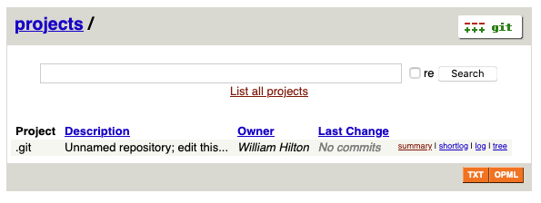
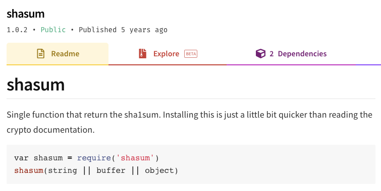
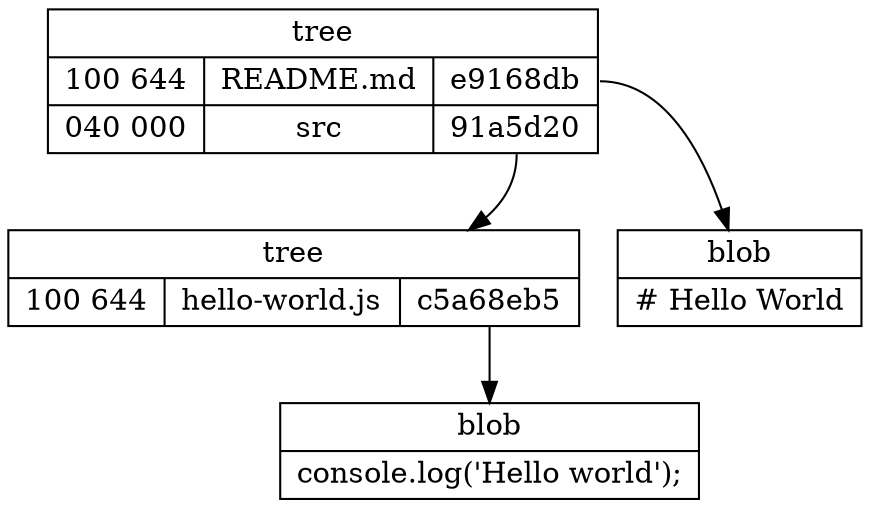
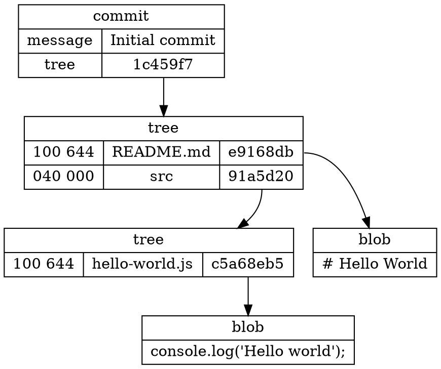
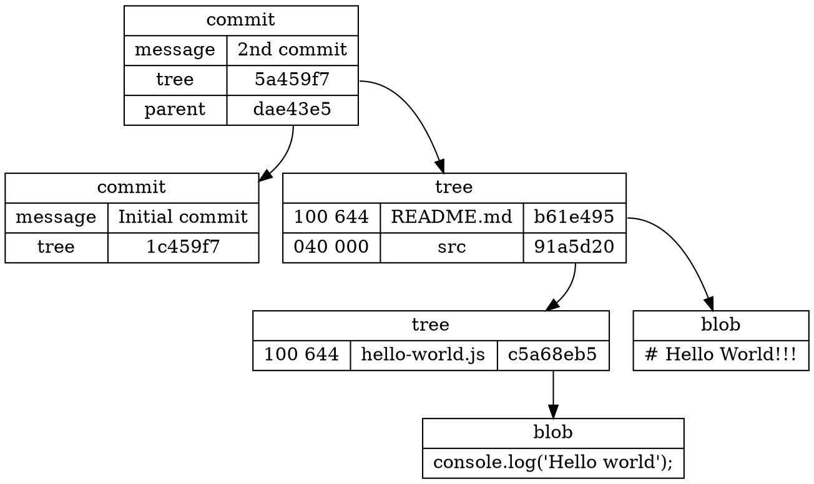
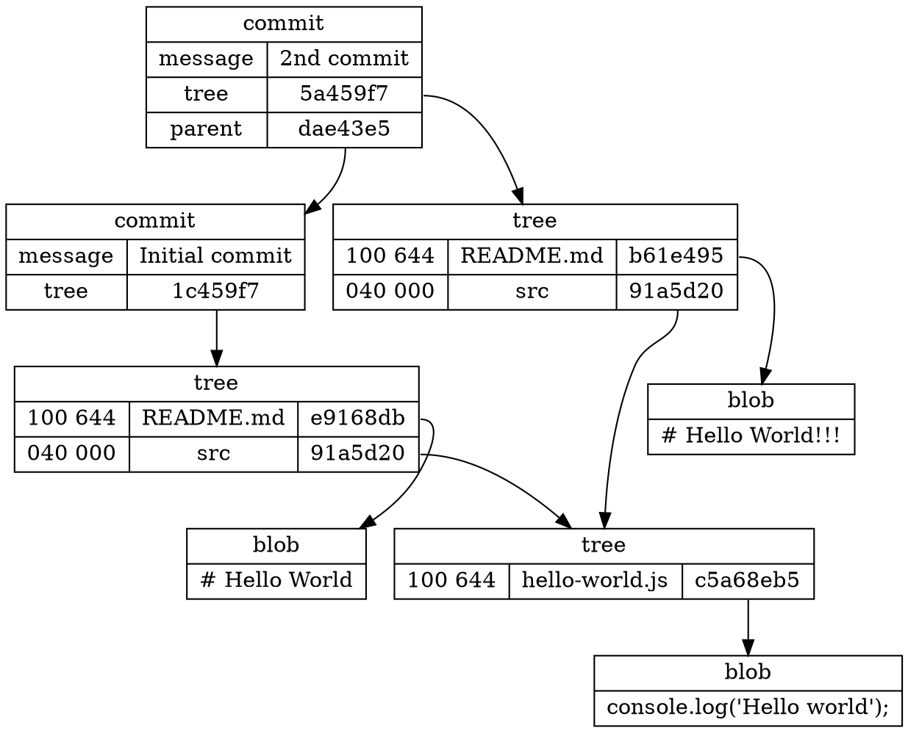
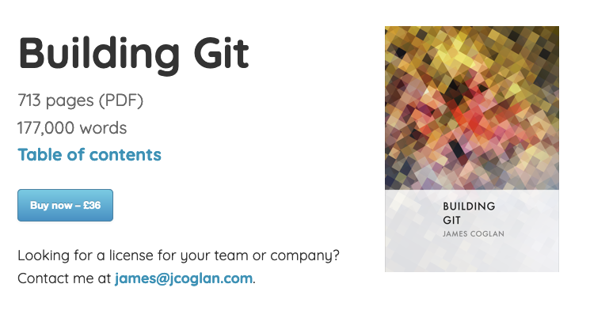

class: center, middle

# Git Demystified

---

# About me

My name is William Hilton. I'm a senior software developer.

I wrote a JavaScript implementation of git called [isomorphic-git](https://isomorphic-git.org/).

<br>


---

# Goals

1. Convince you that the core of git is actually very simple and elegant, despite git's reputation and terrible UX.

2. You'll know _exactly_ what that "staging area" is.

3. You'll know what, exactly, git stores and what it does not.

Sadly, the network protocol didn't fit into the time. If people like this I can prepare another talk on the git network protocol used by "git pull" and "git push".

---

# Table of Contents

1. Typographic conventions
2. Our project
3. `git init`
4. `git add`
5. Git `blob` objects
6. `git commit`
7. Git `tree` and `commit` objects
8. Git `refs`

---

# Typographic conventions

Monospace font represents Terminal commands.

```
> ls

README.md src
```

<br>

The `cat` command prints out the contents of files. 🐱 I'll explain any other commands as they come up.

<br>

This represents a file directory:

<div role="tree">
  <div role="treeitem" aria-expanded="true">
    project
    <div role="group">
      <div role="treeitem">README.md</div>
      <div role="treeitem" aria-expanded="true">
        src
        <div role="group">
          <div role="treeitem">hello-world.js</div>
        </div>
      </div>
    </div>
  </div>
</div>

???

If you haven't used a Terminal application before, it is a primitive way of interacting with computers invented when we only had keyboards. You type commands, hit [Enter] and the commands can print text back at you.

---

# Our project

<div role="tree">
  <div role="treeitem" aria-expanded="true">
    project
    <div role="group">
      <div role="treeitem">README.md</div>
      <div role="treeitem" aria-expanded="true">
        src
        <div role="group">
          <div role="treeitem">hello-world.js</div>
        </div>
      </div>
    </div>
  </div>
</div>

---

# git init

```
> git init
Initialized empty Git repository in project/.git/
```

<div role="tree">
  <div role="treeitem" aria-expanded="true">
    project
    <div role="group">
      <div role="treeitem" aria-expanded="true">
        .git
        <div role="group">
          <div role="treeitem">HEAD</div>
          <div role="treeitem">config</div>
          <div role="treeitem">description</div>
          <div role="treeitem" aria-expanded="true">
            hooks
            <div role="group">
              <div role="treeitem">applypatch-msg.sample</div>
              <div role="treeitem">commit-msg.sample</div>
              <div role="treeitem">fsmonitor-watchman.sample</div>
              <div role="treeitem">post-update.sample</div>
              <div role="treeitem">pre-applypatch.sample</div>
              <div role="treeitem">pre-commit.sample</div>
              <div role="treeitem">pre-merge-commit.sample</div>
              <div role="treeitem">pre-push.sample</div>
              <div role="treeitem">pre-rebase.sample</div>
              <div role="treeitem">pre-receive.sample</div>
              <div role="treeitem">prepare-commit-msg.sample</div>
              <div role="treeitem">update.sample</div>
            </div>
          </div>
          <div role="treeitem" aria-expanded="true">
            info
            <div role="group">
              <div role="treeitem">exclude</div>
            </div>
          </div>
          <div role="treeitem" aria-expanded="true">
            objects
            <div role="group">
              <div role="treeitem" aria-expanded="false">info</div>
              <div role="treeitem" aria-expanded="false">pack</div>
            </div>
          </div>
          <div role="treeitem" aria-expanded="true">
            refs
            <div role="group">
              <div role="treeitem" aria-expanded="false">heads</div>
              <div role="treeitem" aria-expanded="false">tags</div>
            </div>
          </div>
        </div>
      </div>
      <div role="treeitem">README.md</div>
      <div role="treeitem" aria-expanded="true">
        src
        <div role="group">
          <div role="treeitem">hello-world.js</div>
        </div>
      </div>
    </div>
  </div>
</div>

???

`hooks`

---

# git init

<div role="tree">
  <div role="treeitem" aria-expanded="true">
    project
    <div role="group">
      <div role="treeitem" aria-expanded="true">
        .git
        <div role="group">
          <div role="treeitem">HEAD</div>
          <div role="treeitem">config</div>
          <div role="treeitem">description</div>
          <div role="treeitem" aria-expanded="false" class="strike">
            hooks
            <div role="group">
              <div role="treeitem">applypatch-msg.sample</div>
              <div role="treeitem">commit-msg.sample</div>
              <div role="treeitem">fsmonitor-watchman.sample</div>
              <div role="treeitem">post-update.sample</div>
              <div role="treeitem">pre-applypatch.sample</div>
              <div role="treeitem">pre-commit.sample</div>
              <div role="treeitem">pre-merge-commit.sample</div>
              <div role="treeitem">pre-push.sample</div>
              <div role="treeitem">pre-rebase.sample</div>
              <div role="treeitem">pre-receive.sample</div>
              <div role="treeitem">prepare-commit-msg.sample</div>
              <div role="treeitem">update.sample</div>
            </div>
          </div>
          <div role="treeitem" aria-expanded="true">
            info
            <div role="group">
              <div role="treeitem">exclude</div>
            </div>
          </div>
          <div role="treeitem" aria-expanded="true">
            objects
            <div role="group">
              <div role="treeitem" aria-expanded="false">info</div>
              <div role="treeitem" aria-expanded="false">pack</div>
            </div>
          </div>
          <div role="treeitem" aria-expanded="true">
            refs
            <div role="group">
              <div role="treeitem" aria-expanded="false">heads</div>
              <div role="treeitem" aria-expanded="false">tags</div>
            </div>
          </div>
        </div>
      </div>
      <div role="treeitem">README.md</div>
      <div role="treeitem" aria-expanded="true">
        src
        <div role="group">
          <div role="treeitem">hello-world.js</div>
        </div>
      </div>
    </div>
  </div>
</div>

???

`info/exclude`

---

# git init

<div role="tree">
  <div role="treeitem" aria-expanded="true">
    project
    <div role="group">
      <div role="treeitem" aria-expanded="true">
        .git
        <div role="group">
          <div role="treeitem">HEAD</div>
          <div role="treeitem">config</div>
          <div role="treeitem">description</div>
          <div role="treeitem" aria-expanded="false" class="strike">
            hooks
            <div role="group">
              <div role="treeitem">applypatch-msg.sample</div>
              <div role="treeitem">commit-msg.sample</div>
              <div role="treeitem">fsmonitor-watchman.sample</div>
              <div role="treeitem">post-update.sample</div>
              <div role="treeitem">pre-applypatch.sample</div>
              <div role="treeitem">pre-commit.sample</div>
              <div role="treeitem">pre-merge-commit.sample</div>
              <div role="treeitem">pre-push.sample</div>
              <div role="treeitem">pre-rebase.sample</div>
              <div role="treeitem">pre-receive.sample</div>
              <div role="treeitem">prepare-commit-msg.sample</div>
              <div role="treeitem">update.sample</div>
            </div>
          </div>
          <div role="treeitem" aria-expanded="false" class="strike">
            info
            <div role="group">
              <div role="treeitem">exclude</div>
            </div>
          </div>
          <div role="treeitem" aria-expanded="true">
            objects
            <div role="group">
              <div role="treeitem" aria-expanded="false">info</div>
              <div role="treeitem" aria-expanded="false">pack</div>
            </div>
          </div>
          <div role="treeitem" aria-expanded="true">
            refs
            <div role="group">
              <div role="treeitem" aria-expanded="false">heads</div>
              <div role="treeitem" aria-expanded="false">tags</div>
            </div>
          </div>
        </div>
      </div>
      <div role="treeitem">README.md</div>
      <div role="treeitem" aria-expanded="true">
        src
        <div role="group">
          <div role="treeitem">hello-world.js</div>
        </div>
      </div>
    </div>
  </div>
</div>

???

`description`

---

# git init

```
> cat .git/description
Unnamed repository; edit this file 'description' to name the repository.
```

---

# git init

```
> cat .git/description
Unnamed repository; edit this file 'description' to name the repository.
```

It is only used by the `git web` UX. Which you didn't even know existed.

```
> git instaweb --httpd python
Waiting for 'python' to start ... (done)
```



---

# git init

<div role="tree">
  <div role="treeitem" aria-expanded="true">
    project
    <div role="group">
      <div role="treeitem" aria-expanded="true">
        .git
        <div role="group">
          <div role="treeitem">HEAD</div>
          <div role="treeitem">config</div>
          <div role="treeitem" class="strike">description</div>
          <div role="treeitem" aria-expanded="false" class="strike">
            hooks
            <div role="group">
              <div role="treeitem">applypatch-msg.sample</div>
              <div role="treeitem">commit-msg.sample</div>
              <div role="treeitem">fsmonitor-watchman.sample</div>
              <div role="treeitem">post-update.sample</div>
              <div role="treeitem">pre-applypatch.sample</div>
              <div role="treeitem">pre-commit.sample</div>
              <div role="treeitem">pre-merge-commit.sample</div>
              <div role="treeitem">pre-push.sample</div>
              <div role="treeitem">pre-rebase.sample</div>
              <div role="treeitem">pre-receive.sample</div>
              <div role="treeitem">prepare-commit-msg.sample</div>
              <div role="treeitem">update.sample</div>
            </div>
          </div>
          <div role="treeitem" aria-expanded="false" class="strike">
            info
            <div role="group">
              <div role="treeitem">exclude</div>
            </div>
          </div>
          <div role="treeitem" aria-expanded="true">
            objects
            <div role="group">
              <div role="treeitem" aria-expanded="false">info</div>
              <div role="treeitem" aria-expanded="false">pack</div>
            </div>
          </div>
          <div role="treeitem" aria-expanded="true">
            refs
            <div role="group">
              <div role="treeitem" aria-expanded="false">heads</div>
              <div role="treeitem" aria-expanded="false">tags</div>
            </div>
          </div>
        </div>
      </div>
      <div role="treeitem">README.md</div>
      <div role="treeitem" aria-expanded="true">
        src
        <div role="group">
          <div role="treeitem">hello-world.js</div>
        </div>
      </div>
    </div>
  </div>
</div>

???

`objects/info`

`objects/pack`

---

# git init

```
> du .git/objects/*
0	.git/objects/info
0	.git/objects/pack
```

<div role="tree">
  <div role="treeitem" aria-expanded="true">
    project
    <div role="group">
      <div role="treeitem" aria-expanded="true">
        .git
        <div role="group">
          <div role="treeitem">HEAD</div>
          <div role="treeitem">config</div>
          <div role="treeitem" class="strike">description</div>
          <div role="treeitem" aria-expanded="false" class="strike">
            hooks
            <div role="group">
              <div role="treeitem">applypatch-msg.sample</div>
              <div role="treeitem">commit-msg.sample</div>
              <div role="treeitem">fsmonitor-watchman.sample</div>
              <div role="treeitem">post-update.sample</div>
              <div role="treeitem">pre-applypatch.sample</div>
              <div role="treeitem">pre-commit.sample</div>
              <div role="treeitem">pre-merge-commit.sample</div>
              <div role="treeitem">pre-push.sample</div>
              <div role="treeitem">pre-rebase.sample</div>
              <div role="treeitem">pre-receive.sample</div>
              <div role="treeitem">prepare-commit-msg.sample</div>
              <div role="treeitem">update.sample</div>
            </div>
          </div>
          <div role="treeitem" aria-expanded="false" class="strike">
            info
            <div role="group">
              <div role="treeitem">exclude</div>
            </div>
          </div>
          <div role="treeitem" aria-expanded="true">
            objects
            <div role="group">
              <div role="treeitem" aria-expanded="false" class="strike">info</div>
              <div role="treeitem" aria-expanded="false" class="strike">pack</div>
            </div>
          </div>
          <div role="treeitem" aria-expanded="true">
            refs
            <div role="group">
              <div role="treeitem" aria-expanded="false">heads</div>
              <div role="treeitem" aria-expanded="false">tags</div>
            </div>
          </div>
        </div>
      </div>
      <div role="treeitem">README.md</div>
      <div role="treeitem" aria-expanded="true">
        src
        <div role="group">
          <div role="treeitem">hello-world.js</div>
        </div>
      </div>
    </div>
  </div>
</div>

---

# all that matters

<div role="tree">
  <div role="treeitem" aria-expanded="true">
    project
    <div role="group">
      <div role="treeitem" aria-expanded="true">
        .git
        <div role="group">
          <div role="treeitem">HEAD</div>
          <div role="treeitem">config</div>
          <div role="treeitem" class="hide">description</div>
          <div role="treeitem" aria-expanded="false" class="hide">
            hooks
            <div role="group">
              <div role="treeitem">applypatch-msg.sample</div>
              <div role="treeitem">commit-msg.sample</div>
              <div role="treeitem">fsmonitor-watchman.sample</div>
              <div role="treeitem">post-update.sample</div>
              <div role="treeitem">pre-applypatch.sample</div>
              <div role="treeitem">pre-commit.sample</div>
              <div role="treeitem">pre-merge-commit.sample</div>
              <div role="treeitem">pre-push.sample</div>
              <div role="treeitem">pre-rebase.sample</div>
              <div role="treeitem">pre-receive.sample</div>
              <div role="treeitem">prepare-commit-msg.sample</div>
              <div role="treeitem">update.sample</div>
            </div>
          </div>
          <div role="treeitem" aria-expanded="false" class="hide">
            info
            <div role="group">
              <div role="treeitem">exclude</div>
            </div>
          </div>
          <div role="treeitem" aria-expanded="false">
            objects
            <div role="group">
              <div role="treeitem" aria-expanded="false" class="hide">info</div>
              <div role="treeitem" aria-expanded="false" class="hide">pack</div>
            </div>
          </div>
          <div role="treeitem" aria-expanded="true">
            refs
            <div role="group">
              <div role="treeitem" aria-expanded="false">heads</div>
              <div role="treeitem" aria-expanded="false">tags</div>
            </div>
          </div>
        </div>
      </div>
      <div role="treeitem">README.md</div>
      <div role="treeitem" aria-expanded="true">
        src
        <div role="group">
          <div role="treeitem">hello-world.js</div>
        </div>
      </div>
    </div>
  </div>
</div>

???

we've got 2 files and 3 empty directories :laughing:

next up: we're going to find out what happens when you run `git add` on our README file.

---

# `README.md`

```
> cat README.md

# Hello World
```

<div role="tree" class="dim">
  <div role="treeitem" aria-expanded="true">
    project
    <div role="group">
      <div role="treeitem" aria-expanded="true">
        .git
        <div role="group">
          <div role="treeitem">HEAD</div>
          <div role="treeitem">config</div>
          <div role="treeitem" class="hide">description</div>
          <div role="treeitem" aria-expanded="false" class="hide">
            hooks
            <div role="group">
              <div role="treeitem">applypatch-msg.sample</div>
              <div role="treeitem">commit-msg.sample</div>
              <div role="treeitem">fsmonitor-watchman.sample</div>
              <div role="treeitem">post-update.sample</div>
              <div role="treeitem">pre-applypatch.sample</div>
              <div role="treeitem">pre-commit.sample</div>
              <div role="treeitem">pre-merge-commit.sample</div>
              <div role="treeitem">pre-push.sample</div>
              <div role="treeitem">pre-rebase.sample</div>
              <div role="treeitem">pre-receive.sample</div>
              <div role="treeitem">prepare-commit-msg.sample</div>
              <div role="treeitem">update.sample</div>
            </div>
          </div>
          <div role="treeitem" aria-expanded="false" class="hide">
            info
            <div role="group">
              <div role="treeitem">exclude</div>
            </div>
          </div>
          <div role="treeitem" aria-expanded="false">
            objects
            <div role="group">
              <div role="treeitem" aria-expanded="false" class="hide">info</div>
              <div role="treeitem" aria-expanded="false" class="hide">pack</div>
            </div>
          </div>
          <div role="treeitem" aria-expanded="true">
            refs
            <div role="group">
              <div role="treeitem" aria-expanded="false">heads</div>
              <div role="treeitem" aria-expanded="false">tags</div>
            </div>
          </div>
        </div>
      </div>
      <div role="treeitem" class="notdim">README.md</div>
      <div role="treeitem" aria-expanded="true">
        src
        <div role="group">
          <div role="treeitem">hello-world.js</div>
        </div>
      </div>
    </div>
  </div>
</div>

---

# git add

```
> git add README.md
```

<div role="tree" class="dim">
  <div role="treeitem" aria-expanded="true">
    project
    <div role="group">
      <div role="treeitem" aria-expanded="true">
        .git
        <div role="group">
          <div role="treeitem">HEAD</div>
          <div role="treeitem">config</div>
          <div role="treeitem" class="notdim">index</div>
          <div role="treeitem" aria-expanded="true">
            objects
            <div role="group">
              <div role="treeitem" aria-expanded="true" class="notdim">
                e9
                <div role="group">
                  <div role="treeitem" class="notdim">168dbb7daed641f96a493ae7aba8d431b148e2</div>
                </div>
              </div>
            </div>
          </div>
          <div role="treeitem" aria-expanded="true">
            refs
            <div role="group">
              <div role="treeitem" aria-expanded="false">heads</div>
              <div role="treeitem" aria-expanded="false">tags</div>
            </div>
          </div>
        </div>
      </div>
      <div role="treeitem">README.md</div>
      <div role="treeitem" aria-expanded="true">
        src
        <div role="group">
          <div role="treeitem">hello-world.js</div>
        </div>
      </div>
    </div>
  </div>
</div>

???

The majority of all the action in git takes place in either the `index` file or the `objects` directory

---

# `.git/index`

The git index serves two functions:
- stores the "staging area", the list of files include in the next `git commit`.
- caches file metadata to speed up `git status` and `git diff`.

```
> cat .git/index

DIRC_t�|5
{�_t�|5	¿
���}��A�jI:竨�1�H�	README.md�Z�����A���oːw;
```

<br>

^the `DIRC` comes from "directory cache"


---

# `.git/index`

It's a binary format. Here's what it contains:

## <span class="dim"><span class="notdim">Header</span>, Entries Table, Trailer</span>

| what? | version | # of entries |
| ----- | ------- | ------------ |
| DIRC  | 2       | 1            |

---

# `.git/index`

It's a binary format. Here's what it contains:

## <span class="dim">Header, <span class="notdim">Entries Table</span>, Trailer</span>

| `stat*` | size | Object ID | stage† | name length | name |
| ------- | ---- | --------- | ------ | ----------- | ---- ||  |  |  |  |  |
| 2020-10-30 15:33:16                  | 13   | E9168DBB7DAED6...8E2 | 0 | 9           | README.md |

<br>

\*Git compares the file type (regular files vs symbolic links) and executable bits (only for regular files) from `mode` member, `mtime` and `ctime` timestamps, `uid`, `gid`, `ino`, and `size` members. [[source]](https://mirrors.edge.kernel.org/pub/software/scm/git/docs/technical/racy-git.txt)

†Stage 1 and stage 2 are used during manual conflict resolution so the index can track multiple entries for the same file.

---

# `.git/index`

It's a binary format. Here's what it contains:

## <span class="dim">Header, Entries Table, <span class="notdim">Trailer</span></span>

Integrity check.

| Secure Hash Algorithm-1 checksum         |
| ---------------------------------------- |
| CB155AC4EC7FAE898612417F8899DF6FCB90773B |

<span style="white-space: pre">
"Secure Hash Algorithm-1 checksum"
  → "SHA-1 sum"
    → "shasum"


</span>

???

Developed by the National Security Agency (NSA) back when we trusted them.

---

# `.git/index`

## Random Note:

### It only stores files. This is out of laziness.

> "Currently the design of the Git index (staging area) only permits files to be listed, and nobody competent enough to make the change to allow empty directories has cared enough about this situation to remedy it." [-git.wiki.kernel.org](https://git.wiki.kernel.org/index.php/GitFaq#Can_I_add_empty_directories.3F)

This has led to the convention of adding a `.gitkeep` file to any "empty directories" you want to track.

---

# git add

```
> git add README.md
```

```
> cat README.md

# Hello World
```

<div role="tree" class="dim">
  <div role="treeitem" aria-expanded="true">
    project
    <div role="group">
      <div role="treeitem" aria-expanded="true">
        .git
        <div role="group">
          <div role="treeitem">HEAD</div>
          <div role="treeitem">config</div>
          <div role="treeitem" class="notdim">index</div>
          <div role="treeitem" aria-expanded="true">
            objects
            <div role="group">
              <div role="treeitem" aria-expanded="true" class="notdim">
                e9
                <div role="group">
                  <div role="treeitem" class="notdim">168dbb7daed641f96a493ae7aba8d431b148e2</div>
                </div>
              </div>
            </div>
          </div>
          <div role="treeitem" aria-expanded="true">
            refs
            <div role="group">
              <div role="treeitem" aria-expanded="false">heads</div>
              <div role="treeitem" aria-expanded="false">tags</div>
            </div>
          </div>
        </div>
      </div>
      <div role="treeitem">README.md</div>
      <div role="treeitem" aria-expanded="true">
        src
        <div role="group">
          <div role="treeitem">hello-world.js</div>
        </div>
      </div>
    </div>
  </div>
</div>

---

# `.git/objects/e9/168dbb7d...`

```
> cat .git/objects/e9/168dbb7daed641f96a493ae7aba8d431b148e2

xK��OR04fPV�H����/�IC$�
```

<br>

It's compressed with `zlib`.

---

# `.git/objects/e9/168dbb7d...`

```
> npm install -g inflate-cli
```

```
> cat .git/objects/e9/168dbb7daed641f96a493ae7aba8d431b148e2 | inflate

blob 13# Hello World
```

- type: blob
- length: 13 bytes
- content: "# Hello World"

???

Where does `e9168dbb7daed641f96a493ae7aba8d431b148e2` come from?

---

# The file name IS the SHA-1 hash

There's that Secure Hash Algorithm 1 again!

```
> cat .git/objects/e9/168dbb7daed641f96a493ae7aba8d431b148e2 | inflate | shasum

e9168dbb7daed641f96a493ae7aba8d431b148e2  -
```

<br>

So the object id of a blob depends only on the length in bytes, and the content of the file. Not the name, or date, or anything else.

---

# 4 kinds of objects

- blob ("file")
- tree ("directory")
- commit
- tag\*

.footnote[
\*There are 2 kinds of "tags" in git. We'll come back to that.
]

---

# `git commit`

```
> git add src/hello-world.js
> git commit -m 'Initial commit'
[master (root-commit) dae43e5] Initial commit
 2 files changed, 2 insertions(+)
 create mode 100644 README.md
 create mode 100644 src/hello-world.js
```

---

# `git commit`

<div role="tree" class="dim">
  <div role="treeitem" aria-expanded="true">
    project
    <div role="group">
      <div role="treeitem" aria-expanded="true">
        .git
        <div role="group">
          <div role="treeitem" class="notdim">COMMIT_EDITMSG</div>
          <div role="treeitem">HEAD</div>
          <div role="treeitem">config</div>
          <div role="treeitem">index</div>
          <div role="treeitem" aria-expanded="false" class="notdim">
            logs
            <div role="group">
              <div role="treeitem">HEAD</div>
              <div role="treeitem" aria-expanded="true">
                refs
                <div role="group">
                  <div role="treeitem" aria-expanded="true">
                    heads
                    <div role="group">
                      <div role="treeitem">master</div>
                    </div>
                  </div>
                </div>
              </div>
            </div>
          </div>
          <div role="treeitem" aria-expanded="true">
            objects
            <div role="group">
              <div role="treeitem" aria-expanded="true" class="notdim">
                1c
                <div role="group">
                  <div role="treeitem">459f76d9beb28388d57b7f4b78d8e6db758696</div>
                </div>
              </div>
              <div role="treeitem" aria-expanded="true" class="notdim">
                5a
                <div role="group">
                  <div role="treeitem">68eb5f117638e5ff039bd242a4e72d4902f1e9</div>
                </div>
              </div>
              <div role="treeitem" aria-expanded="true" class="notdim">
                91
                <div role="group">
                  <div role="treeitem">a5d202630afbb2f4d927090dcd34f2f797b01d</div>
                </div>
              </div>
              <div role="treeitem" aria-expanded="true" class="notdim">
                da
                <div role="group">
                  <div role="treeitem">e43e585c0605d98a374d50104cec924e47f01d</div>
                </div>
              </div>
              <div role="treeitem" aria-expanded="true">
                e9
                <div role="group">
                  <div role="treeitem">168dbb7daed641f96a493ae7aba8d431b148e2</div>
                </div>
              </div>
            </div>
          </div>
          <div role="treeitem" aria-expanded="true">
            refs
            <div role="group">
              <div role="treeitem" aria-expanded="true">
                heads
                <div role="group" class="notdim">
                  <div role="treeitem">master</div>
                </div>
              </div>
              <div role="treeitem" aria-expanded="false">tags</div>
            </div>
          </div>
        </div>
      </div>
      <div role="treeitem">README.md</div>
      <div role="treeitem">git</div>
      <div role="treeitem" aria-expanded="true">
        src
        <div role="group">
          <div role="treeitem">hello-world.js</div>
        </div>
      </div>
    </div>
  </div>
</div>

---

# Blobs

```
> cat .git/objects/e9/168dbb7daed641f96a493ae7aba8d431b148e2 | inflate

blob 13# Hello World
```

- type: blob
- length: 13 bytes
- content: "# Hello World"

```
> cat .git/objects/5a/68eb5f117638e5ff039bd242a4e72d4902f1e9 | inflate

blob 27console.log('Hello world');
```

- type: blob
- length: 27 bytes
- content: "console.log('Hello world');"


---

# Trees

```
> cat .git/objects/1c/459f76d9beb28388d57b7f4b78d8e6db758696 | inflate

tree 67100644 README.md���}��A�jI:竨�1�H�40000 src���c
```

- type: tree
- length: 67 bytes

| mode    | path      | Object ID                                |
| ------- | --------- | ---------------------------------------- |
| 100 644 | README.md | e9168dbb7daed641f96a493ae7aba8d431b148e2 |
| 040 000 | src       | 91a5d202630afbb2f4d927090dcd34f2f797b01d |

```
> cat .git/objects/91/a5d202630afbb2f4d927090dcd34f2f797b01d | inflate

tree 42100644 hello-world.jsZh�_v8����B��-I��
```

- type: tree
- length: 42 bytes

| mode    | path           | Object ID                                |
| ------- | -------------- | ---------------------------------------- |
| 100 644 | hello-world.js | 5a68eb5f117638e5ff039bd242a4e72d4902f1e9 |

---

# Trees

Although it is represented with 5-6 ASCII bytes, currently only 5 values of `mode` are used:

- "40000": tree (directory)
- "100644": blob (regular file)
- "100755": blob (executable file)
- "120000": blob (symbolic link)
- "160000": commit (git submodule)

---

# Trees & Blobs together

Put together, the trees and blobs are a snapshot of your working directory at the moment of the commit.



---

# Commits

```
> cat .git/objects/da/e43e585c0605d98a374d50104cec924e47f01d | inflate
commit 1040tree 1c459f76d9beb28388d57b7f4b78d8e6db758696
author William Hilton <wmhilton@gmail.com> 1601500473 -0400
committer William Hilton <wmhilton@gmail.com> 1601500473 -0400

Initial commit
```

- type: commit
- length: 1040
- tree: 1c459f76d9beb28388d57b7f4b78d8e6db758696
- author:
  - name: William Hilton
  - email: wmhilton@gmail.com
  - timestamp: 1601500473
  - timezone offset: -0400
- committer: *Can be different from author*
- message: "Initial commit"

---

# Commits

- committer: *Can be different from author*

Wait what? This happens when you rebase, squash, or intentionally commit on someone elses behalf.

```
> git cat-file -p HEAD
tree fcf59d0908a70ab1ba323e9a15964cc041ebcdef
parent fd8f884d553fd9edc3fba5aef51b2054b967d606
author Marcell Toth <marcell@stoplight.io> 1601457327 +0200
committer GitHub <noreply@github.com> 1601457327 +0200
```

It's all lies anyway. You can put whatever time and author you want.

.footnote[
If you want some way to guarantee authenticity you need to use GPG-signed commits.
]

---

# All together

Commits reference a single tree. Trees reference other trees or blobs.



---

# The second commit

```
> echo '!!!' >> README.md

> git add README.md

> git commit -m '2nd commit'

[master 5af8ba7] 2nd commit
 1 file changed, 1 insertion(+), 1 deletion(-)

> cat .git/objects/5a/f8ba79e26dda3c4c5502b0c6753c8c7aafca53 | inflate

commit 229tree 573855fd01f3d946eb4f6b46e8d0ff203abb9f6f
parent dae43e585c0605d98a374d50104cec924e47f01d
author William Hilton <wmhilton@gmail.com> 1601522361 -0400
committer William Hilton <wmhilton@gmail.com> 1601522361 -0400

2nd commit
```

---

# Each commit is a complete snapshot



---

# But commits can reuse existing objects

Git automatically deduplicates identical files.



???

Git used immutable data with structural sharing before it was cool.

---

# Things git doesn't actually store

- It doesn't store changes - it only stores complete directory snapshots.
- It doesn't store the name of a file with the blob, it stores it with the tree.
- It doesn't track the history of individual files.

Git commands like `git log [filename]`, `git blame`, `git diff`, and `git merge` attempt to reconstruct the history of a file with heuristics.

Generally, you can either:
- change a file's contents
- or rename a file

but if you do both at once... eh? Git has to guess.

---

# refs

One last topic to cover: branches!

<div role="tree" class="dim">
  <div role="treeitem" aria-expanded="true">
    project
    <div role="group">
      <div role="treeitem" aria-expanded="true">
        .git
        <div role="group">
          <div role="treeitem">COMMIT_EDITMSG</div>
          <div role="treeitem">HEAD</div>
          <div role="treeitem">config</div>
          <div role="treeitem">index</div>
          <div role="treeitem" aria-expanded="false">
            logs
            <div role="group">
              <div role="treeitem">HEAD</div>
              <div role="treeitem" aria-expanded="true">
                refs
                <div role="group">
                  <div role="treeitem" aria-expanded="true">
                    heads
                    <div role="group">
                      <div role="treeitem">master</div>
                    </div>
                  </div>
                </div>
              </div>
            </div>
          </div>
          <div role="treeitem" aria-expanded="false">
            objects
            <div role="group">
              <div role="treeitem" aria-expanded="true" class="notdim">
                1c
                <div role="group">
                  <div role="treeitem">459f76d9beb28388d57b7f4b78d8e6db758696</div>
                </div>
              </div>
              <div role="treeitem" aria-expanded="true" class="notdim">
                5a
                <div role="group">
                  <div role="treeitem">68eb5f117638e5ff039bd242a4e72d4902f1e9</div>
                </div>
              </div>
              <div role="treeitem" aria-expanded="true" class="notdim">
                91
                <div role="group">
                  <div role="treeitem">a5d202630afbb2f4d927090dcd34f2f797b01d</div>
                </div>
              </div>
              <div role="treeitem" aria-expanded="true" class="notdim">
                da
                <div role="group">
                  <div role="treeitem">e43e585c0605d98a374d50104cec924e47f01d</div>
                </div>
              </div>
              <div role="treeitem" aria-expanded="true">
                e9
                <div role="group">
                  <div role="treeitem">168dbb7daed641f96a493ae7aba8d431b148e2</div>
                </div>
              </div>
            </div>
          </div>
          <div role="treeitem" aria-expanded="true">
            refs
            <div role="group">
              <div role="treeitem" aria-expanded="true">
                heads
                <div role="group" class="notdim">
                  <div role="treeitem">master</div>
                </div>
              </div>
              <div role="treeitem" aria-expanded="false">tags</div>
            </div>
          </div>
        </div>
      </div>
      <div role="treeitem">README.md</div>
      <div role="treeitem">git</div>
      <div role="treeitem" aria-expanded="true">
        src
        <div role="group">
          <div role="treeitem">hello-world.js</div>
        </div>
      </div>
    </div>
  </div>
</div>

---

# refs

They're embarassingly simple.

```
> cat .git/refs/heads/master

5af8ba79e26dda3c4c5502b0c6753c8c7aafca53
```

They are literally just a file with a single line containing the object id of the commit at the tip of the branch.

The only thing special about them is that `git commit` updates the file for you.

---

# HEAD ref

How does `git commit` know _which_ branch to update when you add a new commit?

```
> cat .git/HEAD

ref: refs/heads/master
```

Well that's not super exciting. But wait!

```
> git checkout 5af8ba79e26dda3c4c5502b0c6753c8c7aafca53

You are in 'detached HEAD' state.

> cat .git/HEAD

5af8ba79e26dda3c4c5502b0c6753c8c7aafca53
```

Oh that's what that means.

---

# tags

They are identical to branches actually.

```
> git tag v1.0.0

> cat .git/refs/tags/v1.0.0

5af8ba79e26dda3c4c5502b0c6753c8c7aafca53
```

The only difference is `git commit` doesn't update them when you add new commits. They are meant to be fixed.

---

# `tags`

Later, they invented the "annotated tag" object that is more like a commit.

Instead of an "author" and "commit message", it has a "tagger" and "tag message".

```
> git tag -a v2.0.0 -m 'v2.0.0 has good features'

> cat .git/refs/tags/v2.0.0

78dded00be426898d2eedf751398434ae08ee472

> cat .git/objects/78/dded00be426898d2eedf751398434ae08ee472 | inflate

tag 157object 5af8ba79e26dda3c4c5502b0c6753c8c7aafca53
type commit
tag v2.0.0
tagger William Hilton <wmhilton@gmail.com> 1601528511 -0400

v2.0.0 has good features
```

---

# Stuff I didn't get time to cover

1. `.git/logs`
2. `git clone`
   1. `.git/objects/pack`
   2. `.git/packed-refs`
3. `git merge`
4. `git notes`

---

# I don't have a SoundCloud but...

If you enjoyed this, you'd probably love _Building Git_ by James Coglan.

https://shop.jcoglan.com/building-git/



---

class: center, middle

# The End

Here's a git repo containing an empty directory, <br> created 50697 years in the future:

https://github.com/wmhilton/git-with-empty-dir/
